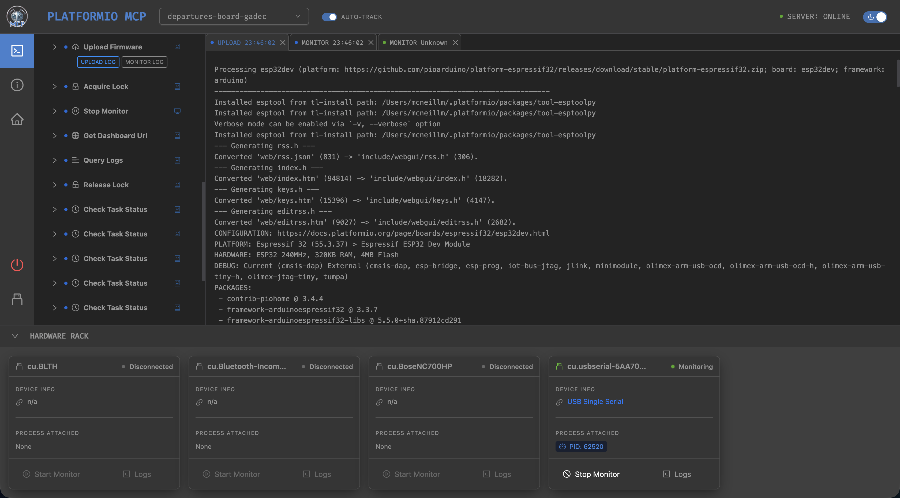
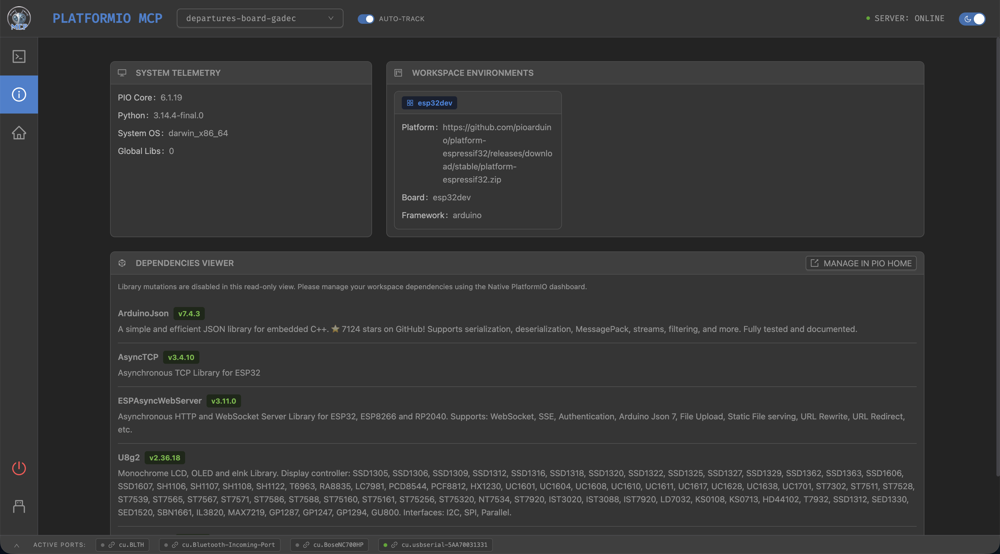
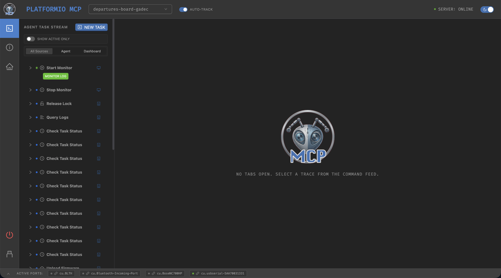
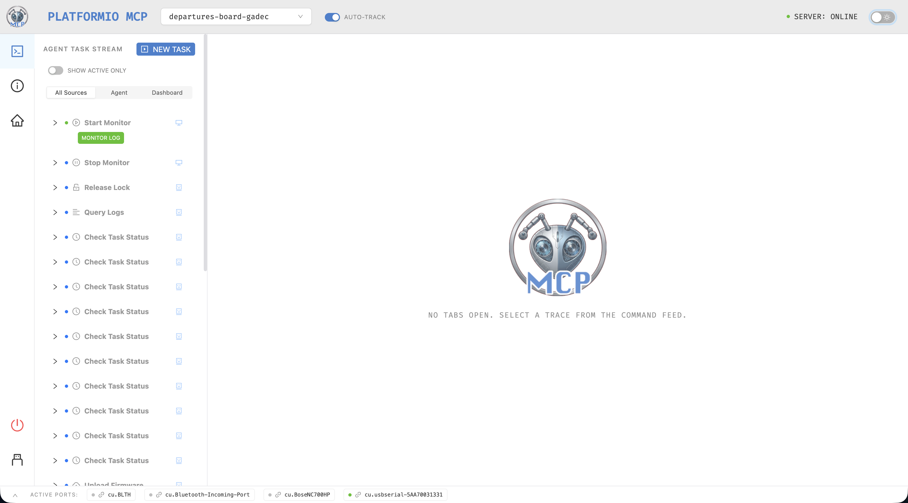
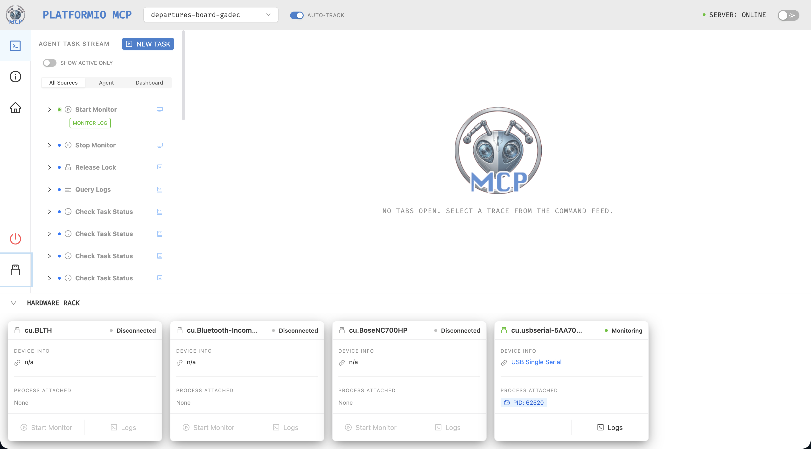
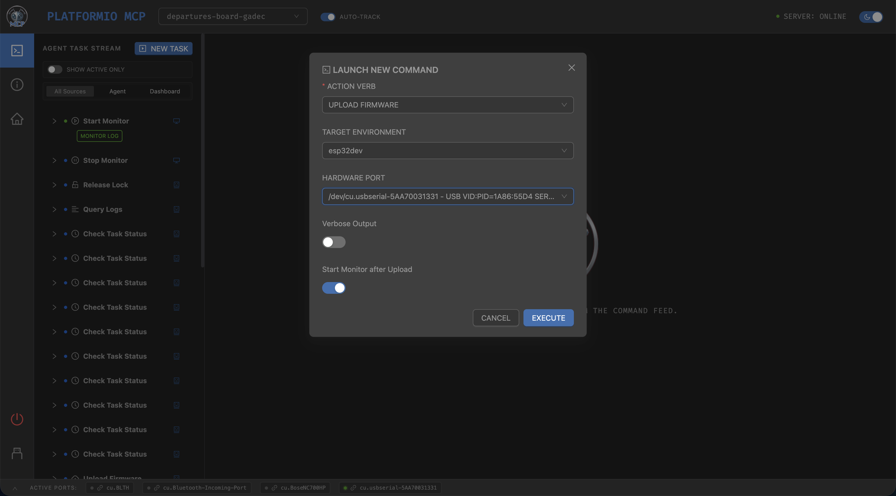

<p align="center">
  
</p>

# PlatformIO MCP Server

## Introduction
The PlatformIO MCP Server acts as a board-agnostic [Model Context Protocol](https://modelcontextprotocol.io) bridge, seamlessly connecting AI agents (like [Antigravity](https://antigravity.google/), [Cline](https://github.com/cline/cline), and [Claude Code](https://docs.anthropic.com/en/docs/claude-code)) to [PlatformIO's](https://platformio.org) comprehensive ecosystem. 

This server solves several critical challenges in embedded AI development:
1. **Bridging the Hardware Gap:** Enables autonomous AI agents to discover, compile, and flash code to over 1,000+ embedded boards across 30+ platforms.
2. **Preventing Context Pollution:** Keeps massive compilation logs and noisy serial traces out of the LLM context window.
3. **Improving Token Efficiency:** Offloads synchronous execution and polling to the server, preserving token budgets.
4. **Providing Human Visibility:** Exposes an opt-in web dashboard, giving human developers a managed build history and transparent view into what the agent is actively compiling or monitoring.
5. **Agentic Empowerment:** Includes pre-packaged `.agents/skills` (such as `@pio-manager` and `@embedded-systems`) to provide the LLM with deep domain expertise in handling port conflicts, device semaphores, and RTOS fundamentals.

<p align="center">
  <a href="docs/assets/pio_mcp_01.png"></a>&nbsp;
  <a href="docs/assets/pio_mcp_02.png"></a>&nbsp;
  <a href="docs/assets/pio_mcp_03.png"></a>
  <br>
  <br>
  <a href="docs/assets/pio_mcp_04.png"></a>&nbsp;
  <a href="docs/assets/pio_mcp_05.png"></a>&nbsp;
  <a href="docs/assets/pio_mcp_06.png"></a>
</p>

## Quick Start

### Just open the dashboard right now

```bash
npx platformio-mcp dashboard
# or the shorter alias:
npx pio-mcp dashboard
```

### Wire it into your AI agent

```bash
npx platformio-mcp install --cline       # Cline (VS Code extension or CLI)
npx platformio-mcp install --claude      # Claude Desktop
npx platformio-mcp install --vscode      # VS Code native MCP support
npx platformio-mcp install --antigravity # Google Antigravity
```

The web dashboard auto-opens in your browser the first time the agent boots
the MCP server.

### Manual install (any other MCP-compatible host)

Add this block to your MCP server config:

```json
{
  "mcpServers": {
    "platformio": {
      "command": "npx",
      "args": ["-y", "platformio-mcp", "--open-dashboard-on-start"]
    }
  }
}
```

> On Windows, replace `"command": "npx"` with `"command": "npx.cmd"` if your
> host doesn't auto-resolve npm shims.

## Core Capabilities


### Features
- Universal board support: works with any PlatformIO-supported board (ESP32, Arduino, STM32, nRF52, RP2040, etc.)
- Complete development workflow: init, build, upload, and monitor
- Library management: search, install, and list from the PlatformIO registry
- Device discovery: detect connected boards automatically
- Board-agnostic: no hardcoded configs, supports all PlatformIO platforms out of the box
- **Workspace Spooling**: `stdout` streams and PIDs are stored cleanly in the `.pio-mcp-workspace/` directory inside the active project folder for easy offline debugging instead of bloating in-memory constraints.
- **Async Polling**: LLM context limits and network timeouts are inherently negated. Dispatch long-running compilations using `background: true` and monitor them safely with `check_task_status`.
- **Opt-in Web Dashboard**: A functional-led PIO Home UI featuring a Command Launcher and Workspace Sidebar. Launch the secure telemetry UI by passing `--open-dashboard-on-start` or setting `PIO_MCP_OPEN_DASH_ON_START=true`. The Web Dashboard enforces strict process isolation through a `PORTAL_AUTH_TOKEN` generated at boot. This cryptographic token ensures that only the authorized LLM session can access the telemetry server, preventing cross-process API leakage or unauthorized local accesses.

### Supported Platforms
PlatformIO supports 30+ embedded platforms including:

| Vendor | Platforms |
|---|---|
| Espressif | ESP32, ESP8266 |
| Arduino | Uno, Mega, Nano, Due |
| STMicroelectronics | STM32, STM8 |
| Nordic | nRF51, nRF52 |
| Raspberry Pi | RP2040 (Pico) |
| Teensy | All Teensy boards |
| Atmel | AVR, SAM, megaAVR |
| NXP | i.MX RT, LPC |
| Microchip | PIC32 |
| TI | MSP430, TIVA |
| RISC-V | SiFive, GAP |

See the full list at [PlatformIO Boards](https://docs.platformio.org/en/latest/boards/).

## Quickstart

### Prerequisites

- Node.js >= 18.0.0
- PlatformIO Core CLI ([install guide](https://platformio.org/install/cli))

```bash
# Install PlatformIO via pip
pip install platformio

# Or via Homebrew on macOS
brew install platformio

# Verify
pio --version
```

### Installation

```bash
git clone https://github.com/jl-codes/platformio-mcp.git
cd platformio-mcp
npm install
npm run build
```

### Usage Example

Add the server to your agent's MCP configuration:

```json
{
  "mcpServers": {
    "platformio": {
      "command": "node",
      "args": [
        "/absolute/path/to/platformio-mcp/build/index.js",
        "--open-dashboard-on-start"
      ]
    }
  }
}
```

> **Note**: For instructions specific to configuring Antigravity, Claude, or Cline, please see our [LLM Installation Guide](docs/LLMInstallationGuide.md).

**What is `--open-dashboard-on-start`?**
This parameter automatically launches the PlatformIO MCP Web Dashboard in your default browser whenever the MCP server is initialized by your AI agent. This provides immediate, real-time visibility into the agent's build processes, background operations, and hardware interactions without requiring a manual UI launch command.

## AI Agent Usage Examples

### Create and upload an ESP32 project

**Prompt your agent:**
> "Initialize a new Arduino project for an ESP32 Dev Board in `/path/to/esp32-blink`. Build the firmware, and upload it while monitoring the serial output."

When you execute a prompt like this, your agent will typically translate it into the following sequence of MCP calls to the server:

```json
// 1. Find the right board ID
{
  "name": "list_boards",
  "arguments": {
    "filter": "esp32"
  }
}

// 2. Initialize project
{
  "name": "init_project",
  "arguments": {
    "board": "esp32dev",
    "framework": "arduino",
    "projectDir": "/path/to/esp32-blink"
  }
}

// 3. Build firmware
{
  "name": "build_project",
  "arguments": {
    "projectDir": "/path/to/esp32-blink"
  }
}

// 4. Upload and start serial monitor
{
  "name": "upload_firmware",
  "arguments": {
    "projectDir": "/path/to/esp32-blink",
    "start_monitor": true
  }
}
```

### Search and install libraries

**Prompt your agent:**
> "Find the ArduinoJson library and install the latest 6.x version into my project at `/path/to/esp32-blink`."

When you execute a prompt like this, your agent will typically make the following MCP calls:

```json
// 1. Search for a library
{
  "name": "search_libraries",
  "arguments": {
    "query": "ArduinoJson",
    "limit": 5
  }
}

// 2. Install library to project
{
  "name": "install_library",
  "arguments": {
    "library": "ArduinoJson",
    "projectDir": "/path/to/esp32-blink",
    "version": "^6.21.0"
  }
}
```

### Launch the Web Dashboard

**Prompt your agent:**
> "Open the PlatformIO MCP web dashboard so I can see the compilation telemetry."

When you execute a prompt like this, your agent will typically make the following MCP call to launch the local UI:

```json
{
  "name": "get_dashboard_url",
  "arguments": {
    "open": true
  }
}
```

## Documentation Index

### Getting Started
- [LLM Installation Guide](docs/LLMInstallationGuide.md)

### Guides & References
- [Agent Customization Guide](docs/reference/AgentCustomizationGuide.md)
- [MCP Server Command Reference](docs/MCPServerCommandReference.md)
- [Troubleshooting & Remediation](docs/TroubleshootingGuide.md)

### Developer Guides and Specifications
- [Development Guide](docs/reference/DevelopmentGuide.md)
- [PIO MCP Design Specification](docs/PIOMCPDesignSpecification.md)
- [Web UX Design Specification](docs/WebUXDesignSpecification.md)

## Contributing & Support

Contributions welcome. Open an issue or submit a pull request.

For issues and questions:
- Open an issue on GitHub
- Check PlatformIO documentation: https://docs.platformio.org
- Join PlatformIO community: https://community.platformio.org

## License

MIT. See [LICENSE](LICENSE).
